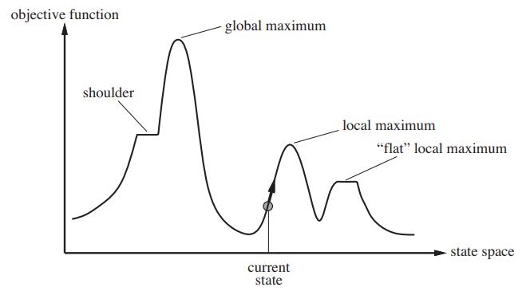
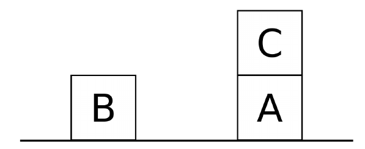
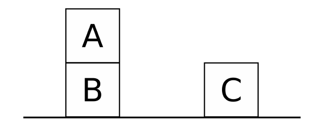
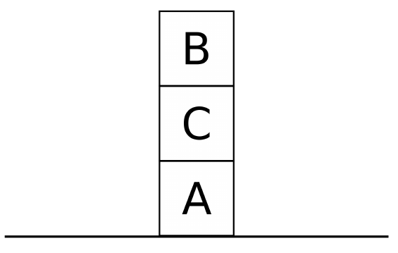

# Domande di Teoria
- [1. Introduzione](#1-introduzione)
  - [1.1. Si introduca brevemente in cosa consiste il Test di Turing. (#1)](#11-si-introduca-brevemente-in-cosa-consiste-il-test-di-turing-1)
- [2. Sistemi Basati sulla Conoscenza (Knowledge Based)](#2-sistemi-basati-sulla-conoscenza-knowledge-based)
  - [2.1. Si introduca brevemente l’architettura di un sistema basato sulla conoscenza e si sottolinei la sua differenza rispetto al concetto di algoritmo. (#2)](#21-si-introduca-brevemente-larchitettura-di-un-sistema-basato-sulla-conoscenza-e-si-sottolinei-la-sua-differenza-rispetto-al-concetto-di-algoritmo-2)
- [3. Strategie di Ricerca](#3-strategie-di-ricerca)
  - [3.1. Si descrivino e si confrontino in termini di complessità spaziale, temporale e ottimalità gli algoritmi di ricerca non informata Depth first, Breadth first e ad approfondimento iterativo, immaginando che il costo degli archi sia sempre uguale a 1. (#3)](#31-si-descrivino-e-si-confrontino-in-termini-di-complessità-spaziale-temporale-e-ottimalità-gli-algoritmi-di-ricerca-non-informata-depth-first-breadth-first-e-ad-approfondimento-iterativo-immaginando-che-il-costo-degli-archi-sia-sempre-uguale-a-1-3)
  - [3.2. Si introduca brevemente il metodo di ricerca ad approfondimento iterativo sottolineandone le caratteristiche. Se ne descriva poi sinteticamente l’algoritmo in pseudocodice. (#4)](#32-si-introduca-brevemente-il-metodo-di-ricerca-ad-approfondimento-iterativo-sottolineandone-le-caratteristiche-se-ne-descriva-poi-sinteticamente-lalgoritmo-in-pseudocodice-4)
  - [3.3. Si introduca brevemente il metodo di ricerca a costo uniforme sottolineandone le caratteristiche. Se ne descriva poi sinteticamente l’algoritmo in pseudocodice. (#5)](#33-si-introduca-brevemente-il-metodo-di-ricerca-a-costo-uniforme-sottolineandone-le-caratteristiche-se-ne-descriva-poi-sinteticamente-lalgoritmo-in-pseudocodice-5)
  - [3.4. Si introduca brevemente il metodo di ricerca locale di Hill-climbing, sottolineandone le caratteristiche. Se ne descriva poi l’algoritmo in pseudo-codice. (#6)](#34-si-introduca-brevemente-il-metodo-di-ricerca-locale-di-hill-climbing-sottolineandone-le-caratteristiche-se-ne-descriva-poi-lalgoritmo-in-pseudo-codice-6)
  - [3.5. Dare il significato di euristica ammissibile, e enunciare le proprietà che ne derivano per l’algoritmo di ricerca A* che utilizzi una tale euristica. (#7)](#35-dare-il-significato-di-euristica-ammissibile-e-enunciare-le-proprietà-che-ne-derivano-per-lalgoritmo-di-ricerca-a-che-utilizzi-una-tale-euristica-7)
  - [3.6. Descrivere la ricerca A* e definire sotto quali condizioni tale algoritmo di ricerca trova la soluzione ottima. Perché sono importanti le euristiche ammissibili? E quelle monotone? (#8)](#36-descrivere-la-ricerca-a-e-definire-sotto-quali-condizioni-tale-algoritmo-di-ricerca-trova-la-soluzione-ottima-perché-sono-importanti-le-euristiche-ammissibili-e-quelle-monotone-8)
- [4. CSP (Constraint Satisfaction Problem)](#4-csp-constraint-satisfaction-problem)
  - [4.1. Si descrivano le strategie CSP di Generate & Test (GT) e di Standard	Backtracking (SB), discutendone	analogie e differenze. (#9)](#41-si-descrivano-le-strategie-csp-di-generate--test-gt-e-di-standardbacktracking-sb-discutendoneanalogie-e-differenze-9)
  - [4.2. Si descrivano brevemente le tecniche di propagazione di vincoli (FC, PLA, FLA) applicabili nella fase di ricerca di una soluzione su una modellazione CSP. (#10)](#42-si-descrivano-brevemente-le-tecniche-di-propagazione-di-vincoli-fc-pla-fla-applicabili-nella-fase-di-ricerca-di-una-soluzione-su-una-modellazione-csp-10)
  - [4.3. Si spieghi cosa è un constraint graph per un problema di CSP e si definiscano i diversi livelli di consistenza da quella di I grado (node consistency) al grado k. (#11)](#43-si-spieghi-cosa-è-un-constraint-graph-per-un-problema-di-csp-e-si-definiscano-i-diversi-livelli-di-consistenza-da-quella-di-i-grado-node-consistency-al-grado-k-11)
  - [4.4. Si discutano gli algoritmi di consistenza di una rete CSP e in particolare si descriva (in pseudocodice) l’algoritmo di arc-consistenza. (#12)](#44-si-discutano-gli-algoritmi-di-consistenza-di-una-rete-csp-e-in-particolare-si-descriva-in-pseudocodice-lalgoritmo-di-arc-consistenza-12)
- [5. Logica](#5-logica)
  - [5.1. Si introducano le definizioni di correttezza e completezza di un sistema assiomatico deduttivo, altrimenti detto teoria assiomatica. (#13)](#51-si-introducano-le-definizioni-di-correttezza-e-completezza-di-un-sistema-assiomatico-deduttivo-altrimenti-detto-teoria-assiomatica-13)
  - [5.2. Si descriva brevemente in cosa consiste la derivazione SLDNF nella programmazione logica. (#14)](#52-si-descriva-brevemente-in-cosa-consiste-la-derivazione-sldnf-nella-programmazione-logica-14)
  - [5.3. Si enuncino a parole e in modo formale le proprietà di correttezza e completezza per un sistema logico. (#15)](#53-si-enuncino-a-parole-e-in-modo-formale-le-proprietà-di-correttezza-e-completezza-per-un-sistema-logico-15)
- [6. Inferenza e logica dei predicati](#6-inferenza-e-logica-dei-predicati)
  - [6.1. Si spieghi con un esempio la differenza fra backward e forward chaining e si discuta quando è preferibile l'applicazione di uno e dell'altro con adeguate motivazioni. (#16)](#61-si-spieghi-con-un-esempio-la-differenza-fra-backward-e-forward-chaining-e-si-discuta-quando-è-preferibile-lapplicazione-di-uno-e-dellaltro-con-adeguate-motivazioni-16)
- [7. Prolog](#7-prolog)
  - [7.1. Si spieghi brevemente il predicato predefinito Prolog `cut`, le sue caratteristiche e si riporti un esempio che ne mostri l’utilizzo. (#17)](#71-si-spieghi-brevemente-il-predicato-predefinito-prolog-cut-le-sue-caratteristiche-e-si-riporti-un-esempio-che-ne-mostri-lutilizzo-17)
  - [7.2. Si spieghi brevemente il predicato predefinito Prolog `findall`. (#18)](#72-si-spieghi-brevemente-il-predicato-predefinito-prolog-findall-18)
  - [7.3. Si spieghi brevemente il predicato predefinito Prolog `call`. (#19)](#73-si-spieghi-brevemente-il-predicato-predefinito-prolog-call-19)
  - [7.4. Si spieghi brevemente il predicato `fail` e i suoi possibili utilizzi. (#20)](#74-si-spieghi-brevemente-il-predicato-fail-e-i-suoi-possibili-utilizzi-20)
  - [7.5. Si spieghi brevemente il predicato `bagof` e `setof` in Prolog. (#21)](#75-si-spieghi-brevemente-il-predicato-bagof-e-setof-in-prolog-21)
  - [7.6. Si dia la definizione di correttezza e di completezza per la logica deduttiva. Il risolutore del linguaggio Prolog è corretto e completo? (#22)](#76-si-dia-la-definizione-di-correttezza-e-di-completezza-per-la-logica-deduttiva-il-risolutore-del-linguaggio-prolog-è-corretto-e-completo-22)
  - [7.7. Si descrivano i predicati Prolog di `assert` e `retract` e il loro utilizzo, eventualmente con anche con l’aiuto di un esempio. (#23)](#77-si-descrivano-i-predicati-prolog-di-assert-e-retract-e-il-loro-utilizzo-eventualmente-con-anche-con-laiuto-di-un-esempio-23)
  - [7.8. Dopo avere spiegato brevemente il predicato predefinito Prolog: not(X) si consideri il seguente programma Prolog: (#24)](#78-dopo-avere-spiegato-brevemente-il-predicato-predefinito-prolog-notx-si-consideri-il-seguente-programma-prolog-24)
  - [7.9. Si descriva il trattamento della negazione in Prolog, si spieghi la differenza rispetto alla negazione classica nonché i limiti e problemi di utilizzo in alcuni casi. Se ne mostri poi l’implementazione nel linguaggio Prolog stesso. (#25)](#79-si-descriva-il-trattamento-della-negazione-in-prolog-si-spieghi-la-differenza-rispetto-alla-negazione-classica-nonché-i-limiti-e-problemi-di-utilizzo-in-alcuni-casi-se-ne-mostri-poi-limplementazione-nel-linguaggio-prolog-stesso-25)
  - [7.10. Si spieghi brevemente in cosa consiste la meta-interpretazione in Prolog specificandone vantaggi e svantaggi. Si mostri il meta-interprete per Prolog puro in Prolog e come modificarlo per tenere in considerazione clausole che possono contenere anche sottogoals in or (simbolo “;”). Ad esempio: (a(X);b(Y)) indica l’or dei due sottogoals a(X) e b(Y). (#26)](#710-si-spieghi-brevemente-in-cosa-consiste-la-meta-interpretazione-in-prolog-specificandone-vantaggi-e-svantaggi-si-mostri-il-meta-interprete-per-prolog-puro-in-prolog-e-come-modificarlo-per-tenere-in-considerazione-clausole-che-possono-contenere-anche-sottogoals-in-or-simbolo--ad-esempio-axby-indica-lor-dei-due-sottogoals-ax-e-by-26)
  - [7.11. Si descriva sinteticamente l’unificazione, dove è utilizzata in Prolog, cos’è l’occur-check e cosa implichi il suo non utilizzo in Prolog. (#27)](#711-si-descriva-sinteticamente-lunificazione-dove-è-utilizzata-in-prolog-cosè-loccur-check-e-cosa-implichi-il-suo-non-utilizzo-in-prolog-27)
- [8.Pianificazione](#8pianificazione)
  - [8.1. Si introduca il sistema STRIPS per la pianificazione, si spieghi come funziona e se ne evidenzino i limiti. (#28)](#81-si-introduca-il-sistema-strips-per-la-pianificazione-si-spieghi-come-funziona-e-se-ne-evidenzino-i-limiti-28)
  - [8.2. Si descriva brevemente, con un esempio a supporto, in cosa consiste l’anomalia di Sussman. (#29)](#82-si-descriva-brevemente-con-un-esempio-a-supporto-in-cosa-consiste-lanomalia-di-sussman-29)
  - [8.3. Si spieghi cosa si intende per pianificazione classica e per pianificazione reattiva, illustrandone le differenze, i vantaggi e gli svantaggi. (#30)](#83-si-spieghi-cosa-si-intende-per-pianificazione-classica-e-per-pianificazione-reattiva-illustrandone-le-differenze-i-vantaggi-e-gli-svantaggi-30)
- [9. Algoritmi genetici (#31)](#9-algoritmi-genetici-31)
## 1. Introduzione
### 1.1. Si introduca brevemente in cosa consiste il Test di Turing. (#1)

Ideato da Alan Turing nel 1950, è un criterio che consente di determinare se una macchina sia in grado di esibire un _comportamento intelligente_.
In questo problema si hanno tre protagonisti: un uomo, una macchina e un interrogante che in una stanza separata deve determinare quale sia l'uomo e quale la macchina.
Una macchina supera il test di Turing se riesce a ingannare l'interrogante, comportandosi come un essere umano.

La macchina deve avere le seguenti capacità:

- elaborazione del linguaggio naturale
- rappresentazione della conoscenza
- ragionamento automatico
- apprendimento automatico

Una variante universale del test di Turing testa anche le abilità percettive della macchina (computer vision), e la sua capacità nel manipolare gli oggetti (robotica).

---
## 2. Sistemi Basati sulla Conoscenza (Knowledge Based)
### 2.1. Si introduca brevemente l’architettura di un sistema basato sulla conoscenza e si sottolinei la sua differenza rispetto al concetto di algoritmo. (#2)

Un sistema Knowledge-Based (KB) è basato fortemente sulla conoscenza del dominio dell'applicazione, ed è costituito da tre macrocomponenti:
- un insieme di operatori (regole);
- una working memory che contiene gli stati correnti;
- una strategia di controllo per selezionare le regole da applicare agli stati della working memory, e che usa _pattern matching_ per la verifica delle precondizioni delle regole.

La differenza tra un sistema KB e un algoritmo risiede al tipo di conoscenza: nel caso di un sistema KB è importante con _cosa_ si ha a che fare (il dominio del problema), mentre per quel che riguarda un algoritmo è importante _come_ viene utilizzata la conoscenza a disposizione per risolvere un determinato problema.

---
## 3. Strategie di Ricerca
### 3.1. Si descrivino e si confrontino in termini di complessità spaziale, temporale e ottimalità gli algoritmi di ricerca non informata Depth first, Breadth first e ad approfondimento iterativo, immaginando che il costo degli archi sia sempre uguale a 1. (#3)

Le strategie di ricerca non informate sono:
- la ricerca in ampiezza (BFS o Breadth First)
- la ricerca in profondità (DFS o Depth First)
- la DFS a profondità limitata
- la ricerca Iterative Deepening

Da adesso in poi facciamo riferimento ai seguenti valori per descrivere complessità spaziale e temporale:
- $b$ = fattore di ramificazione
- $d$ = profondità della soluzione
- $m$ = profondità massima dell'albero di ricerca
- $l$ = limite di profondità

Inoltre, abbiamo i seguenti criteri.
- Per **complessità spaziale** si intende quanto spazio occorre per trovare la soluzione.
- Per **complessità temporale** si intende quanto tempo occorre per trovare la soluzione.
- Per **ottimalità** si intende che la soluzione trovata è la migliore soluzione tra tutte quelle possibili.
- Per **completezza** si intende la certezza che troviamo una soluzione quando ne esiste una.

In seguito si riporta la tabella che riassume in base all'algoritmo scelto i valori dei criteri:

| Criterio  | BFS (con costo arco = 1)  | DFS | DFS-limited  | Iterative deepening (costo arco = 1)  |
|-|-|-|-|-|
| Tempo  | $b^d$  | $b^m$   | $b^l$   | $b^d$  |
| Spazio  | $b^d$   | $b*m$ | $b*l$   | $b*d$  |
| Ottimale?  | Sì*  | No  | No  | Sì*  |
| Completa?  | Sì  | No  | Sì, se $l >= d$  | Sì   |

`*` = dato che si ha costo arco per ciascun step = 1 (ovvero il costo totale del cammino coincide con la profondità di ciascun nodo)

- La **BFS** espande sempre i nodi a profondità **minore** e ha complessità temporale e spaziale $O(b^d)$, dato che in memoria conserva tutte le strade esplorate. La BFS è completa, ma difficile da implementare efficientemente su architetture monoprocessore. 
La BFS è ottimale solo se il costo di ogni nodo coincide con la profondità: nel caso in cui il costo degli archi sia uguale a 1 si ha che la BFS coincide con la strategia a costo uniforme.

- La **DFS** espande i nodi a profondità **maggiore** e in caso di parità si dà preferenza ai nodi più a sinistra. Ha complessità temporale $O(b^d)$ nel caso peggiore in cui esplora tutti i nodi, e può essere non-completa in presenza di cicli. La DFS non trova necessariamente la soluzione ottimale.

- La **DFS a profondità limitata** è una variante della DFS che prevede una profondità massima nella ricerca. In questo modo si evita di scendere lungo rami infiniti, ma non si risolve il problema della completezza, perché potrebbero essitere rami più profondi del limite impostato.

- La ricerca **iterative deepening** è una ricerca DFS a profondità limitata eseguita ripetutamente con valori di $l$ crescenti. In questo modo la ricerca diventa completa, e ottima se il costo di ogni nodo coincide con la profondità, quindi nel caso di `costo arco = 1` è ottimale: ad esempio, per profondità 3 avrremo `costo totale percorso = 3`. Il numero totale di espansioni è comunque $O(bd)$.

---
### 3.2. Si introduca brevemente il metodo di ricerca ad approfondimento iterativo sottolineandone le caratteristiche. Se ne descriva poi sinteticamente l’algoritmo in pseudocodice. (#4)

La ricerca iterative deepening consiste nell'eseguire ripetutamente una ricerca in profondità con valori di profondità $l$ che incrementano progressivamente, finché non viene trovata una soluzione. Con $d$ profondità della soluzione a costo minimo, e $m$ profondità massima dello spazio degli stati, la complessità spaziale è $O(bd)$ in presenza di una soluzione o $O(bm)$ in uno spazio degli stati finito senza soluzione. 

La ricerca iterative deepening è ottimale per problemi nei quali tutte le azioni hanno lo stesso costo ed è completa in tutti gli spazi degli stati finiti e aciclici, o nei quali il controllo dei cicli coinvolge l’intero cammino. La complessità temporale è $O(b^d)$ in presenza di una soluzone e $O(b^m)$ in sua assenza. Ogni iterazione genera un nuovo livello ma, a differenza della ricerca in ampiezza, i livelli precedenti vengono ricalcolati, risparmiando memoria al costo di maggiore tempo. La ricerca in ampiezza può sembrare molto dispendiosa, poiché diversi stati vengono espansi più volte, ma questo non peggiora sensibilmente i tempi di esecuzione.

La ricerca iterative deepening è da preferire quando lo spazio degli stati è troppo vasto per essere memorizzato e la profondità della soluzione non è nota. 

Lo pseudocodice per la ricerca iterative deepening è il seguente:

```
function ITERATIVE-DEEPENING-SEARCH(problem) returns a solution, or failure
    for depth = 0 to ∞ do
        result ← DEPTH-LIMITED-SEARCH(problem,depth)
        if result ≠ cutoff then return result

function DEPTH-LIMITED-SEARCH(problem, l) returns a solution, or failure, or cutoff
    frontier ← a FIFO queue initially containing one path, for the 
    problem's initial state
    solution ← failure
    
    while frontier is not empty do
        parent ← pop(frontier)
        if depth(parent) > l then
            solution ← cutoff
        else
            for child in successors(parent) do
                if child is a goal then
                    return child
                add child to frontier
 return solution
```

### 3.3. Si introduca brevemente il metodo di ricerca a costo uniforme sottolineandone le caratteristiche. Se ne descriva poi sinteticamente l’algoritmo in pseudocodice. (#5)

L’algoritmo di ricerca a costo uniforme svolge una ricerca nella quale i nodi sono inseriti in una coda di priorità, ordinata in modo tale che venga sempre estratto per primo il nodo con la **distanza minore dal nodo di partenza**.
Nei grafi in cui tutti gli archi hanno lo stesso costo l'algoritmo si comporta esattamente come un breadth first.
La ricerca a costo uniforme è completa e ottimale, perché la prima volta che verrà espanso il nodo di arrivo la sua distanza dal nodo di partenza sarà minore o uguale a quella di qualunque altro nodo in coda. La complessità temporale e spaziale della ricerca a costo uniforme è $O(b^{1+C/\epsilon})$

dove:
- b rappresenta il fattore di ramificazione
- C rappresenta il costo ottimale
- $\epsilon$ rappresenta il costo di ciascun step  


Lo pseudocodice per la ricerca a costo uniforme è il seguente:
 
```
function UNIFORM-COST-SEARCH(problem) returns a solution, or failure
    if problem's initial state is a goal then return empty path to initial state
 
    frontier ← a priority queue ordered by pathCost, with a node for the initial state
    reached ← a table of {state: the best path that reached state}; initially empty
    solution ← failure
    while frontier is not empty and top(frontier) is cheaper than solution do
        parent ← pop(frontier)
        for child in successors(parent) do
            s ← child.state
            if s is not in reached or child is a cheaper path than reached[s] then
                reached[s] ← child
                add child to the frontier
                if child is a goal and is cheaper than solution then
                    solution = child
return solution
```

### 3.4. Si introduca brevemente il metodo di ricerca locale di Hill-climbing, sottolineandone le caratteristiche. Se ne descriva poi l’algoritmo in pseudo-codice. (#6)

La ricerca locale è una classe di algoritmi di ricerca informata basata sull’esplorazione di soluzioni vicine a quella corrente che migliorino la situazione, in termini di una funzione di valutazione $f(·)$. 

Una ricerca locale richiede una funzione $F(s)=N(s)$ che definisca $\forall s \in S$, essendo S lo spazio delle soluzioni, una neighborhood $N(s) \subset S$. Questa funzione determina la velocità di convergenza dell’algoritmo e solitamente è definita implicitamente dalle mosse possibili, dato uno stato. 

La funzione $f(·)$ può non essere globalmente concava, quindi non è detto che la ricerca locale converga a un massimo globale. Se l’algoritmo converge a un massimo locale, più sono larghe le neighborhood e più è probabile che si tratti anche di un massimo globale, ma la complessità computazionale aumenta.

L’algoritmo di Hill Climbing prevede che, a ogni passo, si scelga di muoversi verso lo stato nella neighborhood con il valore di $f(·)$ più alto.

Questo tipo di algoritmo non gestisce un albero di ricerca, ma tiene traccia solo dello stato corrente e dei suoi vicini; non avendo una visione globale, $f(·)$ può presentare i seguenti problemi.



- **Massimi locali**: stati migliori di tutti i vicini, ma peggiori di altri stati che non sono nelle vicinanze. Il metodo ci spinge verso il massimo locale di bassa qualità e non uscirne mai.
- **Altopiani**: zone molto piatte nelle quali gli stati vicini hanno tutti lo stesso valore e non è immediato decidere verso quale stato muoversi.
- **Crinali**: stati con un valore maggiore, ai quali non è possibile arrivare direttamente.

Una possibile soluzione a questi problemi è eseguire più volte l’algoritmo con condizioni iniziali casuali, salvare la soluzione migliore e restituirla dopo un certo numero di tentativi, dettato dal tempo di computazione o dal numero di iterazioni:

```
function HILL-CLIMBING(problem) returns a state that is a local maximum
    current ← problem.INITIAL-STATE
    loop do
        neighbor ← a highest-valued successor of current
        if VALUE(neighbour) ≤ VALUE(current) then return current
        current ← neighbor
```

---
### 3.5. Dare il significato di euristica ammissibile, e enunciare le proprietà che ne derivano per l’algoritmo di ricerca A* che utilizzi una tale euristica. (#7)

Un’euristica $h(n)$ è ammissibile se, essendo $d(n)$ la vera distanza di un nodo $n$ al nodo di arrivo (goal) e $V$ l’insieme dei nodi di un grafo, si ha

$h(n) \leq d(n) \hskip{1cm} \forall n \in V$

ovvero l’euristica è ottimistica. Se la ricerca $A^\star$ utilizza un’euristica ammissibile allora è garantito che restituirà la soluzione ottimale (a patto che possa espandere nodi già visitati in passato).


### 3.6. Descrivere la ricerca A* e definire sotto quali condizioni tale algoritmo di ricerca trova la soluzione ottima. Perché sono importanti le euristiche ammissibili? E quelle monotone? (#8) 

La ricerca A* è una ricerca informata di tipo Best-First, che valuta i nodi considerando:
- $g(n)$, ovvero il costo per raggiungere il nodo $n$ dal nodo di partenza
- $h(n)$, ovvero il costo stimato per il percorso più breve dal nodo $n$ al goal

$f(n) = g(n) + h(n)$.

$f(n)$ _rappresenta il costo stimato della soluzione meno costosa attraverso $n$._

Occorre quindi scegliere un nodo con il valore minore di $g(n) + h(n)$.

**NB** Se $h = 0$ allora si ha $f(n) = g(n)$ ovvero una ricerca a costo uniforme, non informata.

**NB2**: Se non si considera $g(n)$ si ha una ricerca Greedy Best-First.

Per la valutazione di una euristica $h(n)$, si considerano:
- **Ammissibilità**: vedi la domanda precedente.
- **Consistenza** (o monotonia): un'euristica $h(n)$ è consistente se, per ciascun nodo $n$ e per ciascun suo successore $n'$ generato da qualsiasi azione $a$, viene rispettata la seguente condizione

  - $h(n) = 0$ se lo stato corrispondente coincide con il goal
  - $h(n) \leq c(n, a, n') + h(n')$.

   con:

  - $c(n, a, n')$ il costo da $n$ a $n'$
  - $h(n')$ il costo per raggiungere il goal da $n'$
  
Se $h(n)$ e’ consistente, $A^\star$ usando Graph-Search e’ ottimale.

**NB**: Ogni euristica consistente è ammissibile, ma non è vero il viceversa.

---
## 4. CSP (Constraint Satisfaction Problem)

### 4.1. Si descrivano le strategie CSP di Generate & Test (GT) e di Standard Backtracking (SB), discutendone	analogie e differenze. (#9)

Le strategie CSP (Constraint Satisfaction Problem) possono essere suddivise in base alla propagazione effettuata in ciascun nodo. Sia GT che SB sono algoritmi senza propagazione.

Nel caso di GT, l'interprete del linguaggio sviluppa e visita un albero decisionale percorrendolo in profondità e assegnando valori alle variabili _senza preoccuparsi di verificare la consistenza con gli altri vincoli_.
Solo in un secondo tempo questa tecnica considera gli altri vincoli rifiutando la soluzione trovata perché incompatibile con i vincoli del problema. A questo punto inizia la procedura di _backtracking_, tentando con la seconda permutazione e così via finché non si trova una soluzione. 

Questa strategia presenta **inefficienza di base**: i vincoli vengono utilizzati per limitare lo spazio delle soluzioni dopo che la ricerca è stata effettuata, quindi _a posteriori_. Inoltre il numero delle possibili permutazioni aumenta con il fattoriale del numero di termini da permutare, quindi si hanno dimensioni inaccettabili rispetto allo spazio di ricerca.

Anche SB, come GT, prevede un utilizzo a posteriori dei vincoli, con la differenza che, a ogni istanziazione di una variabile, si verifica la coerenza della variabile appena istanziata con quelle assegnate precedentemente. Un'altra differenza risulta nell'efficacia di SB rispetto a GT, poiché non si prosegue la ricerca in rami che, ai primi livelli dell'albero, presentano delle
contraddizioni che potevano essere in anticipo risolte.


### 4.2. Si descrivano brevemente le tecniche di propagazione di vincoli (FC, PLA, FLA) applicabili nella fase di ricerca di una soluzione su una modellazione CSP. (#10)

Un CSP (Constraints Satisfaction Problem) ha come obiettivo di trovare uno stato del problema che soddisfi determinati vincoli. 

Un CSP può essere approcciato mediante tecniche di consistenza o algoritmi di propagazione. Gli algoritmi di propagazione sono metodi di ricerca che tentano di prevenire i fallimenti attraverso
il pruning (potatura) dell’albero decisionale. Essi utilizzano le relazioni tra le variabili del problema, ovvero i vincoli, per ridurre lo spazio di ricerca prima di arrivare al fallimento.

Rispetto allo Standard Backtracking, ad ogni assegnazione di variabile, gli algoritmi di propagazione aggiornano e controllano l’insieme di valori ammissibili (domini) di ciascuna variabile ancora da istanziare (variabili future).

- **Forward Checking**: l’assegnazione di un valore ad una variabile ha ripercussioni sull'insieme dei valori disponibili per le variabili ancora libere. In questo modo i vincoli agiscono in avanti (forward) eliminando dai domini delle variabili future i valori incompatibili con la variabile appena istanziata. Se ad un certo punto della computazione il dominio associato ad una variabile risulta vuoto, il meccanismo di Forward Checking fallisce e si esegue backtracking.
  
- **(Partial e Full) Look Ahead**: come avviene nel Forward Checking, ad ogni istanziazione viene controllata la compatibilità dei vincoli contenenti la variabile appena assegnata con le precedenti (istanziate) e le successive (libere); in più si guardano anche i vincoli tra coppie di variabili libere. 
  
  Viene sviluppato cioè il cosiddetto Look Ahead che controlla l’esistenza, nei domini associati alle variabili ancora libere, di valori compatibili con i vincoli contenenti solo variabili ancora libere. Quindi i domini associati a ogni variabile vengono ridotti propagando anche le relazioni tra coppie di variabili non ancora istanziate. Viene verificato che sia possibile una futura assegnazione consistente fra coppie delle variabili libere. 
  
  Esistono due strategie per questa tecnica. 
  - **Partial Look Ahead (PLA)**: nel PLA si ha una propagazione dei vincoli tra la variabile $X_h$, non ancora istanziata, e le variabili future $(X_{h+1} , X_{h+2} , ..., X_{h+n})$.
  -  **Full Look Ahead**: nel FLA se $V_k$ è il valore appena assegnato alla variabile $X_k$, si ha una propagazione dei vincoli tra la variabile $X_h$, non ancora istanziata, e tutte le variabili non ancora assegnate, ossia le variabili $(X_{k+1} , ..., X_{h−1} , X_{h+1} , ..., X_n)$.

Esempio per capire meglio:

È presente il seguente vincolo e a $X0$ è stato appena assegnato il valore 0:

$X0 < X1 < X2 < X3$ con domini per $X1$, $X2$, $X3 :: [1,2,3]$

$X0=0$

PLA, verifica:
- Per ogni valore in D1 se esiste almeno un valore in D2 e almeno un valore in D3 compatibili (sono eliminati i valori di D1 per i quali non esiste alcun valore compatibile in D2 o in D3)
- Per ogni valore in D2 se esiste almeno un valore in D3 compatibile (sono eliminati i valori di D2 per i quali non esiste alcun valore compatibile in D3)

FLA verifica le stesse condizioni di PLA e inoltre controlla:
- Per ogni valore in D2 se esiste almeno un valore in D1 compatibile (sono eliminati i valori di D2 per i quali non esiste alcun valore compatibile in D1).
- Per ogni valore in D3 se esiste almeno un valore in D2 e almeno un valore in D1 compatibili (sono eliminati i valori di D3 per i quali non esiste alcun valore compatibile in D1 o in D2).
  
$PLA \rightarrow X1 :: [1,2], X2 :: [1,2], X3 :: [1,2,3].$

$FLA \rightarrow X1 :: [1,2], X2 :: [2], X3 :: [3]$

### 4.3. Si spieghi cosa è un constraint graph per un problema di CSP e si definiscano i diversi livelli di consistenza da quella di I grado (node consistency) al grado k. (#11)

A differenza degli algoritmi di propagazione che propagano i vincoli in seguito a istanziazioni delle variabili coinvolte nel problema, le tecniche di consistena riducono il problema originale eliminando dai domini delle variabili i valori che non possono comparire in una soluzione finale.

Per applicare tali tecniche bisogna rappresentare il problema come una rete di
vincoli, chiamata grafo dei vincoli (constraint graph). I nodi del constraint graph rappresentano le variabili del CSP, mentre gli archi rappresentano i vincoli tra tali variabili. Si riportano di seguito i vari livelli di consistenza esistenti:

- **Livello 1 - Node Consistency:** la consistenza di grado 1 riguarda un solo nodo. Si dice che un nodo è consistente se per ogni valore $x_i \in D_i$ il vincolo unario $P(i)$ è soddisfatto.
- **Livello 2 - Arc Consistency:** la consistenza di grado 2 si ottiene da un grafo node-consistent e riguarda 2 nodi del grafo. In particolare, questa consistenza verifica se un arco $A(i, j)$ che collega due nodi $X_i$, $X_j$ è consistente. Un arco $A(i, j)$ è consistente se per
ogni valore $x \in D_i$, esiste almeno un valore $y \in D_j$ tale che il vincolo $P(i, j)$ tra $i$ e $j$ sia soddisfatto.
- **Livello 3 - Path Consistency:** la consistenza di grado 3 si ottiene partendo da un grafo
arc consistente e riguarda 3 nodi del grafo. Un cammino $(X_i , X_j , X_k )$ è path-consistente
se, $\forall x \in D_i$ , $y \in Dj$ che rispettano la node e la arc-consistenza esiste un valore $z \in D_k$ che soddisfa i vincoli $P(i, k)$, $P(k, j)$. La consistenza del vincolo unario $P(k)$ è garantita dalla node consistency della rete.
- **Livello k - K-Consistency:** scelti valori per ogni $(k − 1)$-pla di variabili consistenti con i
vincoli imposti dal problema, per ogni $k$-esima variabile si cerca un valore che soddisfi i vincoli tra tutte le $k$ variabili. Se tale valore esiste allore le $k$ variabili sono consistenti.
In generale, se un grafo contenente $n$ variabili è k-consistente con $k < n$, allora per
trovare una soluzione è necessaria una ricerca nello spazio restante.


### 4.4. Si discutano gli algoritmi di consistenza di una rete CSP e in particolare si descriva (in pseudocodice) l’algoritmo di arc-consistenza. (#12)

Un CSP è definito come un insieme di variabili $x_k$ e domini $D_k$ tali che:

$x_k \in D_k \forall k \in 1..n$ 

e di vincoli 

$c_k (x_{i1}, ..., x_{ij}) \in D_{i1} \times ... \times D_{ij}$

su $j$. 

I vincoli solitamente sono rappresentati in termini di relazioni. Trovare una soluzione a un CSP prevede un assegnamento di tutte le $x_k$ che soddisfi tutti i vincoli $c_k$.

Gli algoritmi di consistenza rappresentano il problema come un grafo di vincoli. Gli archi
possono essere orientati o meno a seconda del tipo di relazione: a relazioni non simmetriche
corrispondono archi orientati, a relazioni simmetriche archi non orientati o doppiamente orientati.
I **vincoli unari** sono rappresentati da archi che iniziano e terminano sullo stesso nodo. Gli
algoritmi di consistenza riducono il problema eliminando dai domini delle variabili i valori che
non possono comparire in una soluzione finale. 

La **node-consistency, o consistenza di grado 1**, richiede che ogni valore $x_k \in D_k$ soddisfi i vincoli unari su $x_k$. Per rendere consistente un nodo è necessario eliminare dal dominio di $x_k$ i valori che violano i vincoli. Un grafo è consistente se lo sono tutti i suoi nodi. 

L’**arc-consistency, o consistenza di grado 2**, si ottiene partendo da un grafo node-consistent. Un arco $A(i, j)$ è consistente se per ogni valore $x \in D_i$ esiste almeno un $y \in D_j$ tale che il vincolo $c(i, j)$ tra $i$ e $j$ sia soddisfatto. 

La rimozione di alcuni valori dal dominio di una variabile _rende necessarie ulteriori verifiche_ che coinvolgono i vincoli contenenti la stessa variabile, quindi occorre ripetere il procedimento di rimozione fino a che la rete non raggiunge uno stato di quiescenza. Il controllo della consistenza di un arco può essere applicato come passo di propagazione dopo ogni assegnamento. In questo caso si parla di **maintaining arc-consistency (MAC)**. L’algoritmo completo per il controllo di consistenza si chiama **AC-3**.

AC-3 si serve di una coda di archi alla quale, ogni volta che il dominio di una variabile $i$ viene ridotto, vengono aggiunti gli archi $A(x_k , x_i)$ per ogni variabile $x_k$ collegata da un arco incidente su $x_i$. Lo pseudocodice di AC-3 è il seguente:

```
function AC-3(csp) returns false if an inconsistency is found and true otherwise
 inputs: csp, a binary CSP with components (X, D, C)
 local variables: queue, a queue of arcs, initially all the arcs in csp

 while queue is not empty do
   (Xi, Xj) ← REMOVE-FIRST(queue)
   if REVISE(csp, Xi, Xj) then
     if size of Di = 0 then return false
     for each Xk in Xi.NEIGHBORS − {Xj} do
      add(Xk, Xi) to queue
 return true

```
```
function REVISE(csp, Xi, Xj) returns true if we revise the domain of Xi
 revised ← false
 for each x in Di do
   if no value y in Dj allows (x, y) to satisfy the constraint between Xi and Xj then
    delete x from Di
    revised ← true
 return revised
```

---

## 5. Logica

### 5.1. Si introducano le definizioni di correttezza e completezza di un sistema assiomatico deduttivo, altrimenti detto teoria assiomatica. (#13)

Una teoria assiomatica è definita dai suoi assiomi, formule ben formate (fbf) ritenute vere, e dai suoi criteri di manipolazione sintattica, ovvero le regole usate per derivare fbf da altre fbf. Lo scopo di una teoria assiomatica è _dimostrare la verità_ dei _teoremi_.

Una teoria assiomatica si dice **corretta** se i teoremi dimostrati seguono logicamente dagli assiomi della teoria. La correttezza garantisce che il sistema non permetta di derivare affermazioni false rispetto alla logica sottostante. Se un sistema non è corretto, significa che contiene errori nelle sue regole o negli assiomi.
Si dice inoltre che una teoria è **completa** se tutte le fbf vere rispetto all'interpretazione semantica del sistema possono essere dimostrati come teoremi della teoria. La completezza garantisce che il sistema sia sufficientemente potente per catturare tutta la verità della logica che rappresenta. Se un sistema non è completo, esistono affermazioni vere che non possono essere dimostrate.


### 5.2. Si descriva brevemente in cosa consiste la derivazione SLDNF nella programmazione logica. (#14)

Per risolvere goal generali che possono contenere letterali negativi si introduce un'estensione della risoluzione SLD, nota come risoluzione SLDNF. Combina la risoluzione SLD con la negazione per fallimento (NF).

La selezione di letterali negativi solamente "ground" (ovvero che non contengono variabili) è necessaria per garantire _correttezza_ e _completezza_ della risoluzione SLDNF.

La risoluzione SLDNF è alla base della realizzazione della negazione per fallimento nei sistemi Prolog. Per dimostrare $not \space A$, dove $A$ è un atomo, l'interprete del linguaggio cerca di costruire una dimostrazione per $A$. Se la dimostrazione ha successo, allora la dimostrazione di $not \space A$ fallisce, mentre se la dimostrazione per $A$ fallisce finitamente $not \space A$ si considera dimostrato con successo.

### 5.3. Si enuncino a parole e in modo formale le proprietà di correttezza e completezza per un sistema logico. (#15)

Un sistema logico si dice **corretto** quando non si possono dimostrare fatti falsi.
Un sistema logico si dice **completo** quando tutti i fatti veri sono dimostrabili.
Se T è _corretta_ e _completa_ è garantita l’equivalenza tra l'aspetto sintattico e semantico.

---
## 6. Inferenza e logica dei predicati
### 6.1. Si spieghi con un esempio la differenza fra backward e forward chaining e si discuta quando è preferibile l'applicazione di uno e dell'altro con adeguate motivazioni. (#16)

**Forward e backward chaining** sono strategie utilizzate dal motore di inferenza per effettuare deduzioni.

Le differenze possono essere riassunte nella seguente tabella.

| Forward Chaining                                                                      | Backward Chaining                                                                                                                         |
| ------------------------------------------------------------------------------------- | ----------------------------------------------------------------------------------------------------------------------------------------- |
| Parte dai dati e prende una decisione, arrivando al goal                              | Parte dal goal e lavora a ritroso per determinare quali fatti possono essere verificati, in modo da ottenere il goal da cui si è partiti. |
| Tecnica data-driven, poiché raggiunge il goal a partire dai dati a disposizione       | Tecnica Goal-driven: parte dal goal e raggiunge lo stato iniziale in modo da estrarre i fatti                                             |
| Approccio bottom-up                                                                   | Approccio top-down                                                                                                                        |
| Applica la strategia Breadth-First                                                    | Applica la strategia Depth-First                                                                                                          |
| Il suo obiettivo è arrivare alla conclusione                                          | Il suo obiettivo è di ottenere i possibili fatti o i dati richiesti                                                                       |
| Lento, utilizza tutte le regole a sua disposizione                                    | Veloce, utilizza poche regole                                                                                                             |
| Opera dallo stato iniziale alla decisione finale                                      | Opera dal goal per raggiungere lo stato iniziale                                                                                          |
| Utilizzato per il planning, monitoraggio, controllo e applicazioni di interpretazione | Utilizzato nei motori di inferenza automatizzati, per dimostrazione di teoremi e numerose altre applicazioni in ambito AI                 |

- **Backward Chaining** è preferibile quando:
    - Si ha un obiettivo specifico da verificare.
    - Si desidera ridurre lo spazio di ricerca evitando di considerare regole e fatti non necessari.
    - È importante ottimizzare l'efficienza, ad esempio nei sistemi di diagnostica (come nei sistemi esperti medici).
- **Forward Chaining** è preferibile quando:
    - Si vogliono derivare tutte le possibili conclusioni da un insieme di fatti iniziali.
    - È necessario aggiornare il sistema man mano che nuovi fatti diventano disponibili (ad esempio, nei sistemi di monitoraggio in tempo reale).
    - L'obiettivo non è noto a priori e si cerca di esplorare tutte le implicazioni logiche.

--- 
## 7. Prolog

### 7.1. Si spieghi brevemente il predicato predefinito Prolog `cut`, le sue caratteristiche e si riporti un esempio che ne mostri l’utilizzo. (#17)

Dato un albero SLD contenente le valutazioni delle query eseguite da Prolog, il predicato predefinito `cut` effettua la potatura dell'albero, eliminando alcuni rami non desiderati dallo stack di backtracking. In questo modo si rendono definitive alcune scelte effettuate durante la valutazione di un determinato goal, evitando che vengano trovate soluzioni extra. 

Viene principalmente utilizzato per:
- motivi di efficienza
- mutua esclusione tra clausole

Un esempio di esecuzione è il seguente:
- Abbiamo ha un predicato `nuovaLista(L, Start, End)` che, dati due valori interi `Start` ed `End`, restituisce una lista `L` contenente i valori interi a partire da `Start` fino a `End`. 
- Se `Start > End` dovrà restituire la lista vuota.

    ```prolog
    nuovaLista([], S, E) :- S > E, !.
    nuovaLista([S|T], S, E) :- S1 is S + 1, nuovaLista(T, S1, E).
    ```

- Nel caso in cui avessimo come goal `?- nuovaLista(L,6,3)`, ricadiamo nel primo caso, ed eseguiamo solamente la prima query. Senza `cut`, Prolog avrebbe eseguito anche la seconda query, ottenendo risultati diversi da quelli aspettati, nonché una esecuzione infinita del programma stesso.

Uno svantaggio del predicato `cut` è la perdita di dichiaratività.

### 7.2. Si spieghi brevemente il predicato predefinito Prolog `findall`. (#18)

Il predicato `findall(X, P, L)` è un predicato del secondo ordine che permette di conoscere l’insieme di elementi che soddisfano un dato goal `P`. `findall(X, P, L)` risulta vero se `L` è la lista di istanze di `X` tali che soddisfino il goal `P`. Se non esistono `X` che soddisfino `P`, `L` è la lista vuota (a differenza di `bagof` che fallisce).

### 7.3. Si spieghi brevemente il predicato predefinito Prolog `call`. (#19)
Il predicato predefinito `call(T)` tratta il termine `T` come un atomo predicativo e ne richiede la valutazione all’interprete Prolog. Al momento della valutazione, `T` deve essere istanziato a un termine non numerico, contenente eventualmente delle variabili.

Si può vedere l’interprete Prolog come un loop che chiama all’infinito `read(T), call(T)`.
Il predicato `call` viene considerato un meta-predicato, in quanto
- la sua valutazione interferisce direttamente con l'interprete di Prolog, con la stessa istanza di valutazione;
- altera direttamente il programma.

### 7.4. Si spieghi brevemente il predicato `fail` e i suoi possibili utilizzi. (#20)
`fail` è un predicato senza argomenti la cui valutazione fallisce sempre: in questo modo forza l'interprete ad esplorare altre alternative e attivando il backtracking.
Con `fail` si può:
- ottenere una forma di iterazione sui dati
- implementare Negation as Failure (NF)
- implementare una implicazione logica

### 7.5. Si spieghi brevemente il predicato `bagof` e `setof` in Prolog. (#21)

`setof(X,P,S)` e `bagof(X,P,L)` forniscono in `S` e in `L` rispettivamente l’**insieme** e la **lista** delle istanze `X` che soddisfano il goal `P`. 

`bagof` produce liste in cui possono esservi ripetizioni, mentre `setof` restituisce un insieme senza ripetizioni.

Vediamo un esempio. Supponiamo di avere la base di conoscenza:

```
p(0).
p(1).
p(2).
p(1).
```

Invocando 

`setof(X, P(X), S)` 

otteniamo 

`YES, S=[0,1,2]`.

mentre con 

`bagof(X, P(X), L)` 

otteniamo 

`YES,L=[0,1,2,1]`. In entrambi i casi otteniamo anche `X = X`: alla variabile `X` non verrà assegnato alcun valore.

Inoltre `bagof` e `findall` funzionano allo stesso identico modo, con la differenza che, in caso di mancato soddisfacimento del goal da parte di tutte le istanze `findall` restituisce una lista vuota, mentre `bagof` fallisce.

### 7.6. Si dia la definizione di correttezza e di completezza per la logica deduttiva. Il risolutore del linguaggio Prolog è corretto e completo? (#22)

Un sistema logico è corretto (soundness) se **non** consente di dimostrare fatti falsi (in base alla semantica del sistema stesso).

Un sistema logico è completo (completeness) se consente di dimostrare tutto ciò che è vero (in base alla semantica del sistema stesso).

Dato un sistema logico, esso risulta corretto se e solo se le regole di inferenza del sistema ammettono solo formule valide. O meglio, se partiamo da premesse valide, le regole di inferenza non consentono di giungere a una conclusione non valida.

Un sistema logico risulta **completo** se e solo se tutte le formule valide possono essere dedotte dagli assiomi e dalle regole di inferenza. Non esistono formule invalide che non possano essere dimostrate.

Prolog _non è un sistema completo_, in quanto l'ordine delle clausole del programma può influenzare la sua terminazione e il suo risultato (adottando un approccio di tipo Depth First). Non sempre trova una derivazione, anche se la derivazione esiste. 

Prolog inoltre non è un sistema corretto, poiché non utilizza occur-check: data una variabile V e una struttura S, con S che contiene V, l'unificazione viene ugualemente effettuata da parte dell'interprete di Prolog (ad esempio l'unificazione di `r(X, f(X))` con `r(U U)`), dando origine a fatti falsi dimostrati come se fossero veri, o cicli infiniti.

**NB** per _dimostrazione di un fatto falso_ si intende che esiste una qualsiasi dimostrazione per un fatto, anche se non dovrebbe esistere (ovvero, per la Closed World Assumption + Negation as Failure un fatto è falso se non esiste dimostrazione che sia vero).


### 7.7. Si descrivano i predicati Prolog di `assert` e `retract` e il loro utilizzo, eventualmente con anche con l’aiuto di un esempio. (#23)

Il predicato `assert(X)` aggiunge un nuovo fatto o clausola `X` al database. In particolar modo:
- `asserta(X)` aggiunge la clausola `X` a inizio database
- `assertz(X)` aggiunge in fondo al database la clausola `X`

`X` viene aggiunto al database in una posizione non specificata.

Ad esempio:

```
:- dynamic good/2.
:- dynamic bad/2.
assert(good(skywalker, luke)).
assert(good(solo, han)).
assert(bad(vader, darth)).
```
**NB** `dynamic` consente di utilizzare i predicati dinamici, in modo da potere aggiungere, modificare o cancellare nuovi fatti e regole.

Eseguendo questa query otteniamo:
```
?- listing(good).

:- dynamic good/2.

good(skywalker, luke).
good(solo, han).

true.
```

Il predicato `retract(X)` rimuove un fatto o clausola `X` dal database.


Riprendendo l'esempio di prima e aggiungendo
```prolog
retract(bad(vader, darth)).
```

si avrà:
```
?- bad(vader, darth).
false
```

**NB** Al momento della valutazione, `X` deve essere istanziato a un termine che denota una clausola. 

Gli svantaggi di `assert` e `rectract` sono i seguenti:
- Perdita di dichiaratività dei programmi Prolog.
- L'ordine dei letterali è rilevante nel caso in cui uno dei due letterali sia il predicato `assert`, pertanto ordine diverso può generare risultati diversi:
  - `?- assert(p(a)), p(a).` ha successo
  - `?- p(a), assert(p(a)).` fallisce 
- Quantificazione delle variabili: le variabili in una clausola nel database sono quantificate universalmente, mentre le variabili in una query sono quantificate esistenzialmente.

### 7.8. Dopo avere spiegato brevemente il predicato predefinito Prolog: not(X) si consideri il seguente programma Prolog: (#24)

```prolog
p(3).
c(2,Z):- not (p(Z)).
c(1,3).
```
e si indichino le risposte dell’interprete Prolog alle seguenti query:
```
?- c(Y,3).
?- c(Y,4).
```

Il predicato `not` (deprecato) restituisce `true` se il goal non può essere verificato. La sua implementazione è la seguente:

```prolog
not(P) :- call(P), !, fail.
not(P).
```
Come risposta si ha

```
Y = 1.
Y = 2 .
```
### 7.9. Si descriva il trattamento della negazione in Prolog, si spieghi la differenza rispetto alla negazione classica nonché i limiti e problemi di utilizzo in alcuni casi. Se ne mostri poi l’implementazione nel linguaggio Prolog stesso. (#25)

La negazione classica, che è anche quella utilizzata nelle basi di dati, è basata sulla CWA (Closed World Assumption) in cui se un atomo “ground” $A$ non è conseguenza logica di un programma P, allora si può derivare $\sim A$. Tuttavia, non esiste alcun algoritmo in grado di stabilire in un tempo finito se $A$ non è conseguenza logica di $P$ a causa dell’**indecidibiltà**(semi-decidibilità) della logica del primo ordine. 

Attraverso l’aggiunta di nuovi assiomi alla teoria, infatti, si può modificare l’insieme di teoremi che valeva precedentemente. È proprio per questo motivo che Prolog, cosı̀ come ogni altro linguaggio logico, adotta una negazione per fallimento (“Negation as Failure” - NF). 

Essa si limita a derivare la negazione di atomi la cui derivazione termina con fallimento finito. In particolare, i sistemi Prolog si basano sulla cosiddetta risoluzione SLDNF: per dimostrare $\sim A$, dove $A$ è un atomo, l’interprete del linguaggio cerca di costruire una dimostrazione per $A$. Se la dimostrazione ha successo, allora la dimostrazione di $\sim A$ fallisce. Se, invece, la dimostrazione per $A$ fallisce finitamente si considera $\sim A$ dimostrato con successo. Il problema derivante da questa impostazione è una errata interpretazione dei quantificatori nel caso di letterali non “ground”. 

Si consideri il seguente programma:
```prolog
capitale(roma).
capoluogo(bologna).
citta(X) :- capitale(X).
citta(X) :- capoluogo(X).
```

E si consideri, a questo punto, il goal G:

$\exists X ∼ capitale(X).$


Esiste una entità che non è capitale, ovvero Bologna. Con la risoluzione SLDNF si cerca una dimostrazione per:

$F = \exists X capitale(X).$

Dopo che si nega il risultato si ottiene:

$\sim F = \sim  (\exists Xcapitale(X)).$

Che corrisponde a:

$\sim F = \forall X(∼ capitale(X))$

Quindi se esiste una X che è capitale, ∼ F fallisce, ma la query originaria era:

$F = \exists X \sim capitale(X).$


Ovvero dimostrare che esiste X che non è capitale, che è una query ben diversa. Si rifletta, inoltre, sul fatto che Prolog adotta una regola di selezione dei letterali left-most (non safe).

Questo può generare problemi perchè il significato logico di tali query è diverso da quello atteso. A tal proposito si consideri il seguente programma: 

```
disoccupato(X) :- adulto(X), \+(occupato(X)).
occupato(giovanni).
adulto(mario).
```

Si riportano due query e le relative risposte da parte del programma:
```
?- \+(occupato(giovanni)).
-> no
?- \+(occupato(mario)).
-> yes
3
```

Alla seguente query si ottiene la relativa risposta:
```
?- disoccupato(X).
-> yes X=mario
```

A questo punto consideriamo lo stesso programma, ma con i due sottogoal nel corpo della clausola scambiati:


```prolog
disoccupato(X) :- \+(occupato(X)), adulto(X).
occupato(giovanni).
adulto(mario).
```
E la risposta alla query:

```
?- disoccupato(X).
-> no
```

La risposta è no, perché scambiando i letterali, il letterale negativo viene selezionato quando è ground. Per questo è buona regola di programmazione verificare che i goal negativi siano sempre ground al momento della selezione.

In Prolog è possibile aggiungere al database predicati negati mediante l’operatore `\+`. Ad esempio, per asserire che “un adulto è disoccupato se non è occupato” è possibile asserire

```prolog
disoccupato(X) :- adulto(X), \+occupato(X).
adulto(giovanni).
occupato(mario).
```

A questo punto, la query otterrà il risultato atteso:
```
?- disoccupato(giovanni).
true.
?- disoccupato(mario).
false.
```
Una possibile implementazione della negazione in prolog è la seguente:

```prolog
not(A):- call(A), !, fail.
not(A).
```
Si noti l’utilizzo del metapredicato `fail` che forza il fallimento di una dimostrazione dell’interprete prolog.

### 7.10. Si spieghi brevemente in cosa consiste la meta-interpretazione in Prolog specificandone vantaggi e svantaggi. Si mostri il meta-interprete per Prolog puro in Prolog e come modificarlo per tenere in considerazione clausole che possono contenere anche sottogoals in or (simbolo “;”). Ad esempio: (a(X);b(Y)) indica l’or dei due sottogoals a(X) e b(Y). (#26)

I meta interpreti consentono la realizzazione di meta-programmi, ovvero programmi che operano su altri programmi.

In prolog, un meta-interprete per un linguaggio L è per definizione un interprete per L scritto in Prolog.

**Vantaggi**
- possibilità di sfruttare a fondo le caratteristiche del linguaggio Prolog;
- efficienza;
- facilità di realizzazione.

 **Svantaggi**:
- approccio limitato all'uso di regole di produzione con strategia di inferenza backward;
- scarsa leggibilità e modificabilità dei programmi.

Il meta-interprete per Prolog puro è definito nel seguente modo:

```prolog
solveVan(true) :- !.
solveVan((A, B)) :- !, solveVan(A), solveVan(B).
solveVan(A) :- clause(A, Body), solveVan(Body).    % cerca una calusola che abbia A come testa e Body come corpo, poi prova di risolvere Body
```

Una modalità per implementare un meta-interprete che dimostri l'OR dei sub-goal è la seguente:

```prolog
solveVan(true) :- !.
solveVan((A, _)) :- solveVan(A), !.
solveVan((_, B)) :- !, solveVan(B).
solveVan(A) :- clause(A, Body), solveVan(Body).
```
In particolare:
- la seconda riga risolve `A`;
- la terza riga risolve `B`.
Se una delle due ritorna true 

### 7.11. Si descriva sinteticamente l’unificazione, dove è utilizzata in Prolog, cos’è l’occur-check e cosa implichi il suo non utilizzo in Prolog. (#27)

**Unificazione**: procedimento di manipolazione formale utilizzato per stabilire quando due espressioni possono coincidere procedendo a opportune sostituzioni.
È alla base del sistema di inferenza per la programmazione logica e consente di stabilire se due espressioni (come termini, clausole o predicati) possono essere resi equivalenti.

Con il seguente predicato
```
amici(alice, bob).
```

e data la query
```
?- amici(X,Y).
```

Abbiamo che `X` viene istanziato ad `Alice` e `Y` viene istanziato a `Bob` se la query ha successo. A questo scopo diciamo che `amici(X,Y)` esegue unificazione con il termine `amici(Alice, Bob)`.

**Occur check**:  L'occur check causa il fallimento dell'unificazione della variabile `V` e con la struttura `S`, se `S` contiene `V`.

Necessario per assicurare la terminazione dell’algoritmo e la correttezza del procedimento di unificazione. 

I due termini `X` e `f(X)` non sono unificabili: non esiste una sostituzione per `X` che renda uguali i due termini.

Prolog non utilizza l’occur-check, risulta quindi non corretto. Questo porta ad avere fatti falsi dimostrati come veri o cicli infiniti (ad prolog l'unificazione $X = f(X)$ non termina mai). La mancata implementazione è dovuta al costo elevato e alla possibilità di avere loop infiniti e strutture dati circolari. 

**NB** per _dimostrazione di un fatto falso_ si intende che esiste una qualsiasi dimostrazione per un fatto, anche se non dovrebbe esistere (ovvero, per la Closed World Assumption + Negation as Failure un fatto è falso se non esiste dimostrazione che sia vero).


---
## 8.Pianificazione

### 8.1. Si introduca il sistema STRIPS per la pianificazione, si spieghi come funziona e se ne evidenzino i limiti. (#28)

Lo STanford Research Institute Problem Solving è un pianificatore automatico sviluppato
nel 1971 che permette di rappresentare azioni con sintassi molto semplice ed efficiente. 

Esso campiona delle proprietà che valgono in un determinato istante/stato della realtà nei cosiddetti _fluent_; un esempio di fluent è `ontable(c,s)`.

Il linguaggio di STRIPS permette di:
- Rappresentare lo stato attraverso un insieme di fluent che valgono nello stato. Ad
esempio: `on(b,a)`, `clear(b)`, `clear(c)`, `ontable(c)`, etc.

- Rappresentare il goal, similmente allo stato, attraverso un insieme di fluent. Si possono avere variabili, ad esempio `on(X, a)`
  
- Rappresentare le azioni/regole mediante tre liste:
  - **PRECONDIZIONI**: fluent che devono essere veri per applicare l’azione
  - **DELETE**: fluent che diventano falsi come risultato dell’azione
  - **ADD**: fluent che diventano veri come risultato dell’azione
   
Il pianificatore agisce secondo un algoritmo di ricerca nello spazio degli stati che funge da planner lineare. Esso è basato su una ricerca backward e assume che lo stato iniziale sia completamente noto (Closed World Assumption). 

Come è possibile notare, fa uso di due strutture dati, uno stack di goal e una descrizione S dello stato corrente.

- Il goal è la prima pila di obiettivi.
- Si suddivide il problema in sottoproblemi: ciascuno per un componente dell’obiettivo
originale. Tali sottoproblemi possono interagire.
- Abbiamo tanti possibili ordini di soluzione.
- Ad ogni passo del processo di risoluzione si cerca di risolvere il goal in cima alla pila.
- Quando si ottiene una sequenza di operatori che lo soddisfa la si applica alla descrizione
corrente dello stato ottenendo una nuova descrizione S.
- Si cerca poi di soddisfare l’obiettivo che è in cima alla pila partendo dalla situazione
prodotta dal soddisfacimento del primo obiettivo.
- Il procedimento continua fino allo svuotamento della pila.
- Quando in cima alla pila si incontra una congiunzione si verifica che tutte le sue componenti siano effettivamente soddisfatte nello stato attuale. Se una componente non è
soddisfatta (problema dell’interazione tra goal) si reinserisce nella pila e si continua.

I problemi che tipicamente si hanno con con questo algoritmo risiedono nel fatto che il grafo di ricerca è molto vasto (soluzione: strategie euristiche) e nell’interazione tra i goal: quando due o più goal interagiscono ci possono essere problemi di interazione tra le soluzioni (vedere anomalia di Sussman).

### 8.2. Si descriva brevemente, con un esempio a supporto, in cosa consiste l’anomalia di Sussman. (#29)
L’anomalia di Sussman è un problema che sorge nella pianificazione lineare quando un goal
viene diviso in più sottogoal, da soddisfare uno dopo l’altro. Questo può portare a definire più sottogoal che interagiscono in modo tale che soddisfare un goal richieda di smettere di soddisfarne un altro. L’anomalia evidenzia la non completezza della pianificazione lineare e la necessità di offrire _interleaving_, ovvero la possibilità di compiere azioni pertinenti a più sottogoal diversi, per poter rendere completo un algoritmo di questo tipo.

L’esempio canonico di anomalia di Sussman è quello in cui è richiesto di impilare tre blocchi A, B, e C partendo con B a terra e C sopra A, come nella figura seguente:



Un algoritmo di pianificazione lineare suddividerebbe il goal nei due sottogoal “impila A su B” e “impila B su C”. Tuttavia, soddisfare il primo goal nella maniera più efficiente porta il sistema nello stato descritto dalla figura seguente:



A questo punto, soddisfare l’altro sottogoal richiede di disfare quanto appena compiuto. Se, al contrario, si soddisfa per primo il secondo sottogoal, ci si ritrova comunque in una situazione di stallo, la seguente:



È possibile arrivare al goal finale, ma non in maniera efficiente, il che mette in mostra una debolezza della pianificazione lineare.

### 8.3. Si spieghi cosa si intende per pianificazione classica e per pianificazione reattiva, illustrandone le differenze, i vantaggi e gli svantaggi. (#30)

La pianificazione è la definizione di un piano, ovvero un insieme totalmente o parzialmente ordinato dai azioni che portino lo stato di un sistema da uno stato di partenza a un goal desiderato.

La pianificazione **classica**, o offline, prevede la definizione di un piano le cui azioni possono essere modificate in fase di pianificazione, ma non durante l’esecuzione del piano. A questo fine, la pianificazione classica si avvale di una rappresentazione istantanea, detta **snapshot**, dello stato corrente. 

La pianificazione classica presume che solamente le azioni parte del piano modifichino lo stato di un sistema, che i cambiamenti di stato siano totalmente deterministici, che lo stato iniziale sia totalmente noto a priori e che le azioni vengano eseguite in modo atomico. Queste assunzioni sono molto forti e raramente verificate in sistemi reali.

Per questo motivo si fa strada la pianificazione **reattiva**, o online, che considera il sistema come dinamico e non deterministico e può alterare il piano anche durante l’esecuzione, dato che continua a osservare lo stato del sistema anche in questa fase.

## 9. Algoritmi genetici (#31)

Gli algoritmi genetici sono algoritmi di ricerca locale, che consentono di migliorare una soluzione $s \in S$, utilizzando una funzione di valutazione detta _fitness_.

Un algoritmo genetico agisce nel seguente modo:
1) Viene generata una prima popolazione di soluzioni (dette cromosomi)
2) Si applica la funzione di fitness sulla popolazione
3) Si sceglono i valori più alti in base ai risultato restituito dalla funzione di fitness per ciascun figlio
4) Si generano nuove soluzioni ibride tramite:
   - crossover, che consiste nel combinare due cromosomi, in modo da ottenere una soluzione figlia. 
   - random mutation: si applica un delta che corrisponde alla mutazione su una soluzione s
   Come risultato si avrà una nuova popolazione composta da soluzioni ottenute tramite crossover

5) Si scelgono i valori più alti risultanti dalla applicazione della funzione di fitness sulle soluzioni ottenute al punto 4)
6) Si continua con il punto 4) e 5) fino a quando si ottiene una soluzione che soddisfi dei requisiti minimi, o in base al numero di generazioni, o in base alle risorse allocate.